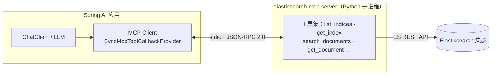
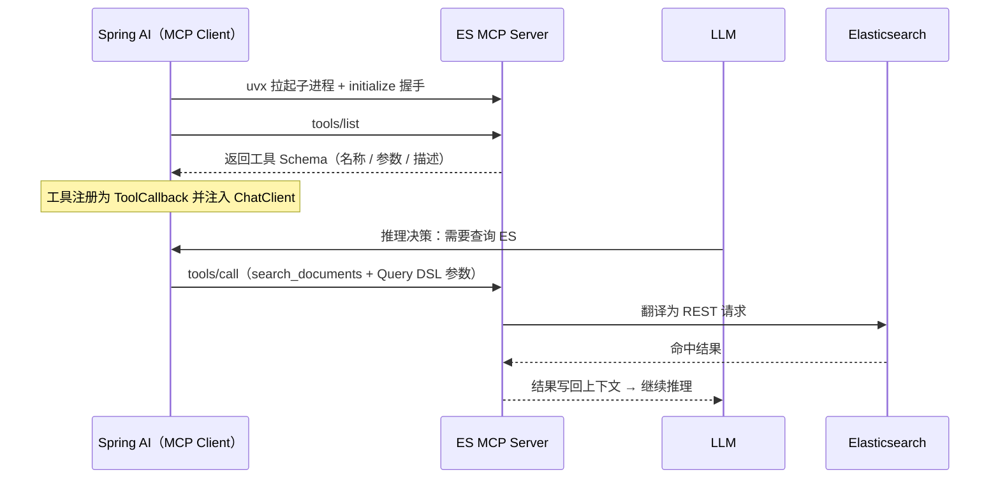
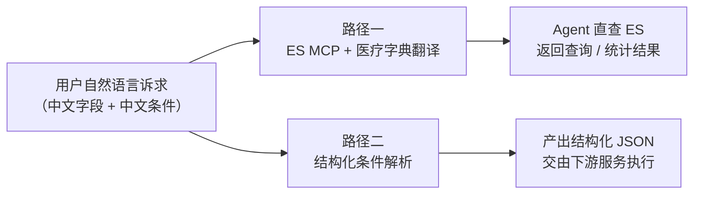
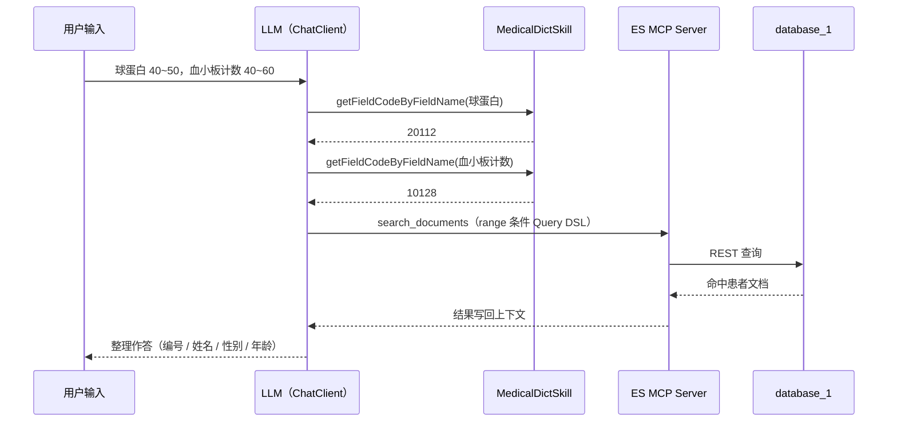
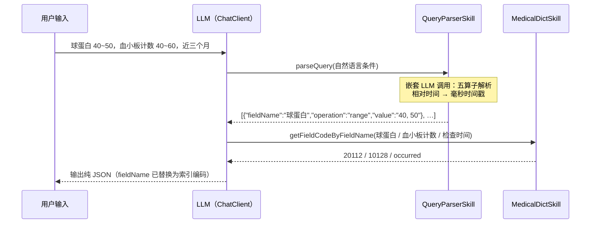

# Spring AI × MCP

医疗数据智能查询 Agent —— 自然语言驱动

<div class="abs-br m-6 text-xs opacity-50">

github.com/CJ-Zheng1023/learn-spring-ai-agent

</div>

---

# 目录

<div class="grid grid-cols-2 gap-x-12 gap-y-6 pt-4">

<div>

**第一章 · Elasticsearch MCP Server**

MCP 在智能体中的作用 · Server 原理 · 项目配置方式

**第二章 · 项目技术栈**

Spring Boot 4.1 · Spring AI 2.0 · MCP Client · Elasticsearch

</div>

<div>

**第三章 · 演示内容预览**

自然语言直查 ES 返回结果 · 自然语言转结构化 JSON

**第四章 · AgentRunner 代码走读**

run 方法两个 if / else 分支逐一讲解

</div>

</div>

---
layout: intro
---

# 第一章 · Elasticsearch MCP Server

MCP 在智能体中的作用 / Server 原理 / 项目配置方式

---

### 第一章 · Elasticsearch MCP Server

# 什么是 Agent（智能体）

Agent = 在 LLM 之上扩展出 **自主行动能力** 的 AI 系统

- **感知** —— 接收自然语言诉求与上下文信息
- **规划** —— LLM 拆解目标，决定调用什么、先后顺序
- **行动** —— 调用外部 **工具（Tools）** 完成模型自身做不到的事
- **反馈** —— 工具结果写回上下文，迭代修正，直到任务完成

<div class="pt-4">

Agent 的能力边界，取决于它能调用的 **工具** —— 本项目为 Agent 装配了两类工具：**Elasticsearch 查询**（MCP 提供）、 **医疗字典翻译**和**结构化json转换**（本地 Skill）。

</div>

---

### 第一章 · Elasticsearch MCP Server

# MCP 在 Agent 中的作用

**MCP（Model Context Protocol）**：连接 LLM 与外部工具 / 数据的开放标准协议 —— AI 世界的 "USB-C 接口"

- **标准化接入** —— JSON-RPC 2.0 之上定义 `tools / resources / prompts` 三类能力，一次适配、处处可用
- **彻底解耦** —— Agent 不关心工具如何实现，工具服务不关心上层是哪个模型
- **生态复用** —— 同一个 MCP Server 可被任意 MCP Client 共享（Claude / Spring AI / IDE …）
- **本项目** —— Agent 通过 MCP 零侵入地获得 Elasticsearch 探查与检索能力，无需编写 ES 客户端代码

---

### 第一章 · Elasticsearch MCP Server

# Elasticsearch MCP Server 原理

`uvx elasticsearch-mcp-server`：Python 实现的开源 MCP Server，把 ES REST API 封装为一组 LLM 可调用的工具



---

### 第一章 · Elasticsearch MCP Server

# 启动与工具调用时序



---

### 第一章 · Elasticsearch MCP Server

# 项目中的配置方式

<div class="grid grid-cols-5 gap-6 items-start">
<div class="col-span-3">

```yaml
spring:
  ai:
    mcp:
      client:
        enabled: true
        stdio:
          connections:
            elasticsearch:
              command: uvx
              args: ["elasticsearch-mcp-server"]
              env:
                ELASTICSEARCH_URL: http://10.13.37.154:9200
```

</div>
<div class="col-span-2">

- **stdio 传输** —— `uvx` 按需拉起 Python MCP Server 子进程，随应用启停
- **环境变量注入** —— ES 地址 / 凭据通过 `env` 下发，与代码完全解耦
- **自动装配** —— `spring-ai-starter-mcp-client` 依据配置创建 MCP Client
- **一行接入** —— `SyncMcpToolCallbackProvider` 把所有 MCP 工具注入 `ChatClient`

</div>
</div>

---
layout: intro
---

# 第二章 · 项目技术栈

---

### 第二章 · 项目技术栈

# 技术选型一览

| 类别 | 技术 |
| --- | --- |
| 语言 | Java 21 |
| 框架 | Spring Boot 4.1 |
| AI 框架 | Spring AI 2.0 |
| 模型 | OpenAI 兼容 API |
| mcp | elasticsearch-mcp-server |
| 构建 | Maven |

---

### 第二章 · 项目技术栈

# Spring AI 核心依赖（pom.xml）

```xml
<dependencies>
    <!-- 聊天模型：OpenAI 兼容接口（mimo-v2.5） -->
    <dependency>
        <groupId>org.springframework.ai</groupId>
        <artifactId>spring-ai-starter-model-openai</artifactId>
    </dependency>
    <!-- MCP 客户端：按 application.yml 自动对接 ES MCP Server -->
    <dependency>
        <groupId>org.springframework.ai</groupId>
        <artifactId>spring-ai-starter-mcp-client</artifactId>
    </dependency>
</dependencies>
```

- `spring-ai-bom 2.0.0` 通过 `dependencyManagement` 统一管理 Spring AI 版本
- Spring Boot 4.1 父 POM · Java 21 · Lombok 简化 POJO

---
layout: intro
---

# 第三章 · 演示内容预览

同一条中文诉求 · 两条不同的落地路径

---

### 第三章 · 演示内容预览

# 两条演示路径总览



<div class="pt-2">

一条 "查数据并回答"，一条 "只翻译、不执行" —— 对应 Agent 的两种典型定位：**执行者** 与 **理解器**。

</div>

---

### 第三章 · 演示内容预览

# 演示一 · 自然语言 → 字典翻译 → ES 直查返回结果

<div class="grid grid-cols-2 gap-8">
<div>

**场景**

> 查询球蛋白数值在 40 到 50 区间，并且血小板计数在 40 到 60 之间的患者数据

**难点：编码存储**

ES 中字段并非中文，而是编码：球蛋白 = `20112`、血小板计数 = `10128`、"生化全套" 对应索引 `1`。LLM 无法直接理解。

</div>
<div>

**链路**

1. LLM 调用 **MedicalDictSkill**，把检查类型 / 字段中文名翻译成索引 / 字段编码
2. 经 **ES MCP Server** 的 `search_documents` 组装 Query DSL，在 `database_1` 索引执行查询或统计
3. LLM 将命中结果整理成简洁回答

**输出约定**

患者数据仅返回 编号 / 姓名 / 性别 / 年龄 四字段；统计仅回结果；System Prompt 约束 **只读禁写**。

</div>
</div>

---

### 第三章 · 演示内容预览

# 演示二 · 自然语言 → 结构化 JSON → 下游服务

<div class="grid grid-cols-2 gap-8">
<div>

**场景**

已有患者筛选服务只接受结构化条件 —— Agent 不亲自查库，只负责把中文诉求 **翻译** 成标准 JSON。

> 查询球蛋白数值在 40 到 50 区间，并且血小板计数在 40 到 60 之间，检查时间为近三个月的患者数据

</div>
<div>

**链路**

1. LLM 调用 **QueryParserSkill**（内部再发起一次 LLM 调用），按五算子 `range / neq / eq / contains / excludes` 解析出条件数组
2. 相对时间自动换算："近三个月" → 13 位毫秒时间戳区间；输出经 `sanitizeJson` 净化
3. LLM 再调用 **MedicalDictSkill**，把 JSON 中 `fieldName` 中文名翻译为字段索引编码

**产出**

纯 JSON 条件数组，交由下游业务服务执行查询 —— Agent 与执行系统职责彻底分离。

</div>
</div>

---
layout: intro
---

# 第四章 · AgentRunner 代码走读

run 方法中的两个 if / else 分支

---

### 第四章 · AgentRunner 代码走读

# AgentRunner 类总览

```java {all|2-5|8-13}
@Component
public class AgentRunner implements CommandLineRunner {

    private final ChatClient chatClient;                 // 聊天客户端（承载大模型）
    private final SyncMcpToolCallbackProvider mcpTools;  // ES MCP Server 的全部工具
    private final MedicalDictSkill medicalDictSkill;     // 医疗字典翻译
    private final QueryParserSkill queryParserSkill;     // 结构化条件解析

    @Override
    public void run(String... args) {
        if (args[0].equals("t1")) { /* 场景一：MCP 直查 ES */ }
        else                        { /* 场景二：结构化条件解析 */ }
        System.out.println(result);
        System.exit(0);
    }
}
```

构造器注入 4 个依赖；命令行参数决定分支：`t1` → 演示一，其余 → 演示二。

---

### 第四章 · AgentRunner 代码走读

# 分支一（t1）· 提示词与调用代码

```java {all|1-6|7-9|11-15}
String systemPrompt = """
    请充分利用好工具，在查询和统计之前需要把检查类型名称和字段名称转换为所对应的索引编码。
    要求限定在database_1库中进行查询和统计。
    假如查询的是患者数据，返回内容限定在患者编号(patientNo)、患者姓名、性别和年龄。
    假如是统计类的查询，则只返回统计结果。
    严禁修改es数据，只可查询，只读不可写！
    """;
String userPrompt = """
    查询球蛋白数值在40到50区间，并且血小板计数在40到60之间的患者数据。
    """;

result = chatClient.prompt()
        .tools(mcpTools, medicalDictSkill)   // ← 同时挂载 ES MCP 工具 + 字典工具
        .system(systemPrompt)
        .user(userPrompt)
        .call().content();
```

---

### 第四章 · AgentRunner 代码走读

# 分支一 · 运行时序



---

### 第四章 · AgentRunner 代码走读

# 分支二（else）· 提示词与调用代码

```java {all|1-4|5-7|9-13}
String systemPrompt = """
    仅返回json结构数据。
    需要将json中的fieldName属性需要通过工具转成所对应的字段索引编码。
    """;
String userPrompt = """
    查询球蛋白数值在40到50区间，并且血小板计数在40到60之间，
    检查时间为近三个月的患者数据。
    """;

result = chatClient.prompt()
        .tools(queryParserSkill, medicalDictSkill)  // ← 无 MCP：纯文本层面的工具组合
        .system(systemPrompt)
        .user(userPrompt)
        .call().content();
```

---

### 第四章 · AgentRunner 代码走读

# 分支二 · 运行时序



---

### 第四章 · AgentRunner 代码走读

# 两个分支对比

| | 分支一 · t1 | 分支二 · else |
| --- | --- | --- |
| 工具挂载 | `mcpTools` + `medicalDictSkill` | `queryParserSkill` + `medicalDictSkill` |
| LLM 角色 | 检索编排者：自己把数据查出来 | 翻译器：只产出查询条件 |
| 数据流 | 诉求 → 编码翻译 → ES 查询 → 作答 | 诉求 → 条件解析 → 编码翻译 → JSON |
| 输出形态 | 自然语言（患者数据 / 统计结果） | 结构化 JSON 条件数组 |
| 执行落点 | 直接读 Elasticsearch | 交由下游服务执行 |

<div class="pt-2">

共同内核：**MedicalDictSkill 跨越 "中文 → 编码" 的语义鸿沟**；MCP 把引擎能力标准化地交给模型。

</div>

---
layout: statement
---

# 谢谢观看

[github.com/CJ-Zheng1023/learn-spring-ai-agent](https://github.com/CJ-Zheng1023/learn-spring-ai-agent)
